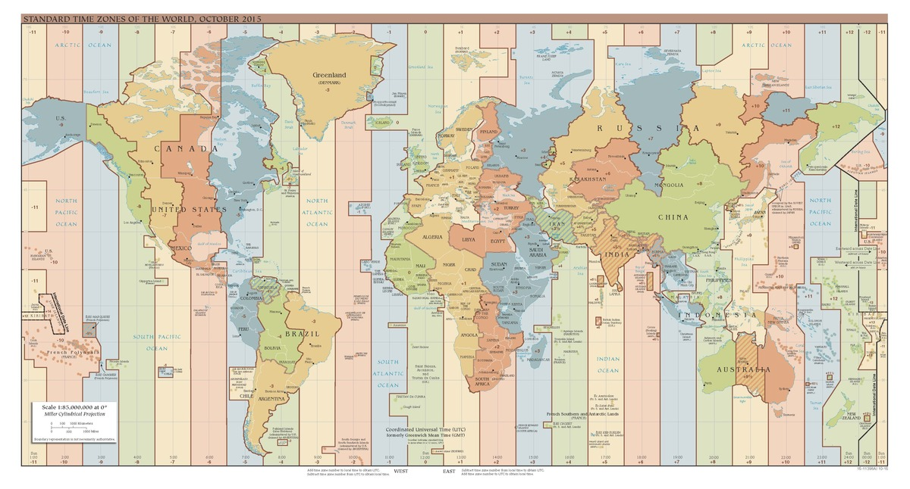

# utc2nwislocal---UTC Date-Times to NWIS Local Time-Zones using UTC Offsets


#### Author:           William H. Asquith
#### Point of contact: William H. Asquith (wasquith@usgs.gov)
#### Year:             2019
#### Digital Object Identifier (DOI):
#### USGS Information Product Data System (IPDS) no.:  (internal agency tracking)
***

_Suggested Citation:_

Asquith, W.H., 2019, utc2nwislocal---UTC date-times to NWIS local time-zones using UTC
offsets: R package, U.S. Geological Survey software release,
Reston, Va.,
[https://code.usgs.gov/wasquith/utc2nwislocal]

_Authors' ORCID nos.:_
William H. Asquith, 0000-0002-7400-1861.

***
***

# DESCRIPTION

The **utc2nwislocal** package provides a light-weight, dependency-free utility for converting Coordinated Universal Time (UTC) `base::as.POSIXct()` date-time values into character-string representations for time zones. The UTC offset for individual time zones are determined from the time-zone codes recognized by the U.S. Geological Survey National Water Information System (NWIS) (U.S. Geological Survey, 2019). The time zones are tracked in a separate database slot than the UTC date-time.

The justification for this package is that the time-zone codes are not standard to the `base::OlsonNames()` within base _R_, but the NWIS names are an ANSI SQL/92 time-zone offset string. NWIS stores date-times exclusively in UTC, and certain data retrievals can be (purposefully) kept in UTC, though commonly NWIS switches to the time zone in output.

The package resides on the link shown in the _Suggested Citation_. Please consult this README along with other files (`CONTRIBUTING.md`, `DISCLAIMER.md`, `LICENSE.md`).

## Example of Use

One of the primary interfaces is the `utc2nwislocal()` function. In the following example, UTC is transformed to Pacific Daylight Time (PDT):
```{r}
  utc2nwislocal(as.POSIXct("2016-07-14 15:30:00"), tz="PDT", "m", secpad=FALSE)
  # [1] "2016-07-14 08:30 PDT"
```

United States Pacific Daylight Time (PDT) is -07:00 hours behind of GMT. Pacific Daylight Time (PDT) replaces Pacific Standard Time during summer when daylight savings comes into effect. Pacific Standard Time is a UTC -8:00 timezone offset which means Pacific Standard Time is -8:00 hours ahead of Coordinated Universal Time.

Two other interfaces are acquiring the hour and second offsets from UTC. The first example is for Australia Eastern Standard Time that is +11:00 hours ahead of UTC. The second example is for United States Central Daylight Time (CDT) and Central Standard Time (CST) and shows that the functions are vectorized.
```{r}
  nwislocal2utc_offset_hours("AESST")          # 11:00 hours
  nwislocal2utc_offset_seconds(c("CDT","CST")) # -18000, -21600 seconds
```

# PACKAGE INSTALLATION

## Package Homepage (Installation from Source)

To get release updates, use one of the following example commands, which requires the **remotes** package to be installed:

```{r}
  library(remotes)
  # Option 1
  install_git("https://code.usgs.gov/wasquith/utc2nwislocal.git")

  # Option 2
  install_url("https://code.usgs.gov/wasquith/utc2nwislocal/-/archive/master/utc2nwislocal.zip")
```

## Additional Notes on Package Installation form Sources

Attention to which TAR (unzipping software) is used to unpack compressed files (inflate the repository) is needed for some Windows operating system users. For example, on some Windows machines with Esri ArcGIS software installed, the `tar.exe` distributed with ArcGIS will automatically run, but that `tar.exe` does not provide for zip inflation. The error message will look like this:
```{r}
  C:\ArcGIS\gbin\tar.exe: Cannot use compressed or remote archives
  C:\ArcGIS\gbin\tar.exe: Error is not recoverable: exiting now
```
The easiest fix is to specify use of the `TAR="internal"` built into _R_ through the `Sys.setenv(TAR="internal")` command as shown above.


# FURTHER DETAILS

The design of this package is to be compliant with the requirements of the _R_ Comprehensive R Archive Network (CRAN). Hence, the standard idioms to the language for package compliance testing, installation, and user manual building can be made by (at least on non-Windows platforms), respectively, the following commands at the operating system console:
```{r}
  R CMD check --as-cran utc2nwislocal
  R CMD INSTALL utc2nwislocal
  R CMD Rd2pdf --force utc2nwislocal
  R CMD check --as-cran --run-donttest MGBT; # A more rigorous checking
```
More details and background related to the **utc2nwislocal** package including its historical context, purpose, use, and demonstration of features are found within the user manual. In particular, the _R_ documentation file `man/utc2nwislocal.Rd` is the canonical starting point, and that starting point can be initiated after package installation through the following commands at the _R_ prompt:
```{r}
  library(utc2nwislocal)
  ?"utc2nwislocal"
```

The most critical component of the package is the hidden _R_ environment `.NWIStzUTC` provided by the `./utc2nwislocal/R/sysdata.rda` file, which is creatable by the script `./utc2nwislocal/inst/doc/buildSYSDATA(R).txt`. (The script is given a `.txt` file extension to keep _R_ from complaining when the **utc2nwislocal** package is checked for CRAN compliance.)

The `.NWIStzUTC` environment is not exported but forced access can be used if readers are very curious: `utc2nwislocal:::.NWIStzUTC` (triple colon). This environment contains three subordinate environments that are hash-tabled lookups of timezones and UTC offsets. Below are some examples for inspecting the contents.
```{r}
  ls(utc2nwislocal:::.NWIStzUTC) # results shown below
  # [1] "TimeZone_Names"     "TimeZone_Offset"     "TimeZone_Offset_seconds"
  ls(utc2nwislocal:::.NWIStzUTC$TimeZone_Names) # results shown below
  #  [1] "ACSST"  "ACST"   "ADT"    "AESST"  "AEST"   "AFT"    "AKDT"   "AKST"
  #  [9] "AST"    "AWSST"  "AWST"   "BT"     "CADT"   "CAST"   "CCT"    "CDT"
  # [17] "CET"    "CETDST" "CST"    "DNT"    "DST"    "EASST"  "EAST"   "EDT"
  # [25] "EET"    "EETDST" "EST"    "FST"    "FWT"    "GST"    "HDT"    "HST"
  # [33] "IDLE"   "IDLW"   "IST"    "IT"     "JST"    "JT"     "KST"    "LIGT"
  # [41] "MDT"    "MEST"   "MET"    "METDST" "MEWT"   "MEZ"    "MST"    "MT"
  # [49] "NDT"    "NFT"    "NOR"    "NST"    "NZDT"   "NZST"   "NZT"    "PDT"
  # [57] "PST"    "SADT"   "SAT"    "SET"    "SST"    "SWT"    "UTC"    "WADT"
  # [65] "WAST"   "WAT"    "WDT"    "WET"    "WETDST" "WST"    "ZP-11"  "ZP-2"
  # [73] "ZP-3"   "ZP11"   "ZP4"    "ZP5"    "ZP6"
```


# REFERENCES

U.S. Geological Survey, 2019, USGS water data for the Nation: U.S. Geological Survey National Water Information System database, accessed August 9, 2019, at https://doi.org/10.5066/F7P55KJN.
